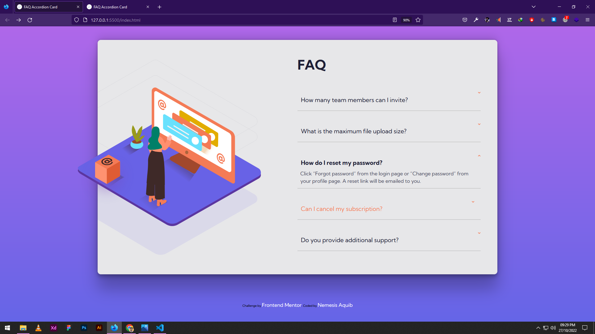

# Frontend Mentor - FAQ accordion card

## Welcome! 👋

Thanks for checking out this front-end coding challenge.

[Frontend Mentor](https://www.frontendmentor.io) challenges help you improve your coding skills by building realistic projects.

**To do this i make this  without use js**
 ## Author
 Nemesis-Aquib<>

 
- Frontend Mentor - [@nemesisaquib](https://www.frontendmentor.io/profile/nemesisaquib)
- Twitter - [@Aquibjaved_1989](https://twitter.com/Aquibjaved_1989)
- github - [nemesisaquib](https://github.com/nemesisaquib)

**I completed this challenge without using javascript i only use css thank you**